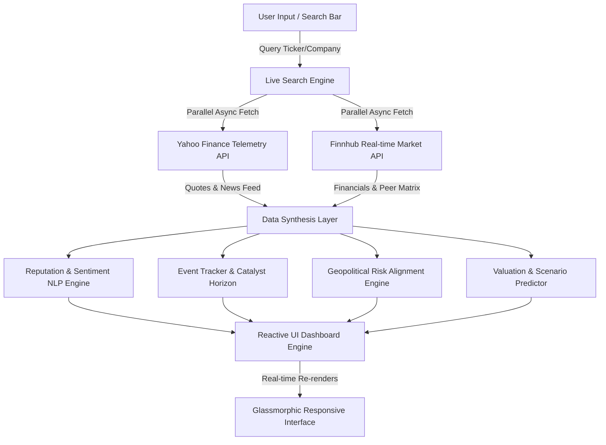

<div align="center">

  # ⚡ Vibe Trading Engine

  **Autonomous Live Market Telemetry, Sentiment NLP & Geopolitical Risk Research Platform**

  [](https://vibe-trading-virid.vercel.app/)
  [](https://react.dev/)
  [](https://vitejs.dev/)
  [](https://tailwindcss.com/)
  [](https://github.com/gnshx/vibe-trading)
  [](LICENSE)

  <br />

  [🌐 **Explore Live Application**](https://vibe-trading-virid.vercel.app/) • [📖 **Documentation**](#-system-architecture) • [⚡ **Quickstart**](#-getting-started) • [🧪 **Run Tests**](#-testing--quality-assurance)

</div>

---

## 📌 Executive Overview

**Vibe Trading Engine** is an enterprise-grade institutional market research dashboard engineered to synthesize **real-time global equities data**, **live NLP news sentiment analysis**, **event catalyst tracking**, and **geopolitical risk alignment** into actionable financial intelligence.

Unlike traditional static financial terminals, Vibe Trading operates on a **zero-hardcoded-data paradigm**. Entering any global ticker (`AAPL`, `NVDA`, `TSLA`, `RELIANCE.NS`, `SONY`, `AIRBUS`, etc.) instantly triggers parallel live API queries across public telemetry endpoints to construct a comprehensive 360° company research profile, sentiment trajectory, and scenario-based 24-month valuation models in milliseconds.

---

## ✨ Key System Capabilities

### 🔍 1. Autonomous Real-Time Global Telemetry
- **Instant Ticker & Entity Resolution:** Real-time search across global market exchanges (NASDAQ, NYSE, LSE, NSE, TSE).
- **Live Fundamentals & Quotes:** Instant parsing of market capitalization, trailing P/E ratio, 52-week price corridors, volume, and primary exchange market hours.

### 🧠 2. NLP News Sentiment & Net Vibe Scoring Engine
- **Algorithmic Vibe Index (0–100):** Weighted multi-variable sentiment engine parsing news headline sentiment, publisher authority, media buzz volume, and controversy signals.
- **Dynamic Narrative Extraction:** Automatically identifies macro market catalysts and positive/negative sentiment distributions from real-time news feeds.

### ⏳ 3. Dual-Horizon Event Catalyst Tracking
- **Short-Term Catalysts (Days):** Live tracking of upcoming earnings calls, product launches, and operational updates with probability scoring and direction bias.
- **Long-Term Horizons (Years):** Multi-year strategic expansion timelines and commercial milestone modeling.

### 🌐 4. Geopolitical & Strategic Risk Alignment
- **Sovereign & Regulatory Mapping:** Evaluates corporate alignment with host country leadership, regulatory compliance bodies, and cross-border commercial stability.
- **Strategic Alliances & Joint Ventures:** Tracks multi-billion-dollar enterprise tie-ups, cloud infrastructure deals, and institutional distribution partnerships.

### 📈 5. Reactive Valuation & Price Scenario Modeling
- **Interactive Price Projections:** Dynamic target range modeling with Bearish, Base, and Bullish scenario controls powered by Recharts.
- **Multi-Factor Projection Engine:** Synthesizes fundamental P/E multiples, revenue growth velocity YoY, and sentiment momentum into 24-month target prices.

---

## 🏗 System Architecture & Data Flow



---

## 🛠 Tech Stack & Core Dependencies

| Category | Technology | Rationale & Engineering Highlights |
|---|---|---|
| **Core Framework** | React 18.3 | Concurrent rendering mode, modular component hierarchy, custom hooks |
| **Build Tooling** | Vite 6.0 | Lightning-fast HMR (<100ms), optimized production Rollup bundling |
| **Styling & UI** | Tailwind CSS 3.4 + Custom CSS | Glassmorphism UI tokens, custom keyframe animations, dark mode native |
| **Data Visualization** | Recharts 2.15 | Responsive SVG chart rendering with custom tooltips and active dot states |
| **Icons** | Lucide React | High-performance, scalable vector iconography |
| **Testing Suite** | Vitest 2.1 | Fast unit and integration test runner for mathematical modeling engines |
| **Deployment** | Vercel Serverless Edge | Global CDN distribution with zero-cold-start edge delivery |

---

## 🚀 Getting Started

### Prerequisites
- **Node.js**: `^18.0.0` or `^20.0.0` or `^22.0.0`
- **Package Manager**: `npm` (v9+) or `pnpm` / `yarn`

### Installation & Local Setup

1. **Clone the Repository**
   ```bash
   git clone https://github.com/gnshx/vibe-trading.git
   cd vibe-trading
   ```

2. **Install Dependencies**
   ```bash
   npm install
   ```

3. **Start the Development Server**
   ```bash
   npm run dev
   ```
   *Open [http://localhost:5173](http://localhost:5173) in your browser to view the application.*

4. **Build for Production**
   ```bash
   npm run build
   ```

---

## 🧪 Testing & Quality Assurance

The application includes unit tests for core financial algorithms, sentiment scoring, and price valuation modules.

```bash
# Run unit tests with Vitest
npm test
```

---

## 📂 Repository Structure

```
VIBE-TRADING/
├── public/
│   └── favicon.svg                  # Brand SVG mark
├── src/
│   ├── components/
│   │   ├── CompanySearch.jsx         # Live search bar with dynamic autocomplete
│   │   ├── EventsTimeline.jsx       # Short-term & long-term event horizon UI
│   │   ├── Header.jsx               # Navigation bar with status indicators & key modal
│   │   ├── Logo.jsx                 # Custom SVG branding component
│   │   ├── TieUpGeopoliticsMap.jsx  # Geopolitical risk & alliance visualizer
│   │   ├── ValuationPredictionChart.jsx  # Interactive valuation chart with scenario controls
│   │   └── VibeScoreCard.jsx        # Sentiment breakdown & Net Vibe Index card
│   ├── services/
│   │   ├── liveResearchEngine.js    # Master live market telemetry search & news synthesizer
│   │   ├── finnhubApi.js            # Finnhub REST client with localStorage token handling
│   │   ├── reputationService.js     # NLP news sentiment analysis & vibe score algorithm
│   │   ├── eventTracker.js          # Catalyst event extraction & impact classifier
│   │   ├── geopoliticalService.js   # Country risk & leadership alignment modeler
│   │   └── valuationPredictor.js    # Multi-scenario target price algorithm
│   ├── tests/
│   │   ├── eventTracker.test.js     # Unit tests for catalyst engine
│   │   ├── reputationService.test.js# Unit tests for sentiment scorer
│   │   └── valuationPredictor.test.js # Unit tests for financial predictor
│   ├── App.jsx                      # Main application state orchestration shell
│   ├── index.css                    # Tailwind directives & design system tokens
│   └── main.jsx                     # Application root entry point
├── index.html                       # HTML5 entry with meta SEO headers
├── vite.config.js                   # Vite configuration & plugin pipeline
├── tailwind.config.js               # Theme extensions & custom color palette
└── package.json                     # Project manifest & dependency lock
```

---

## 🔒 Security & Architectural Best Practices

- **Zero API Key Leakage:** Public telemetry requests are executed directly client-side. Optional user-configured API tokens (e.g. Finnhub) are stored strictly in client `localStorage` and never committed or transmitted to remote backend servers.
- **Fail-Safe Fallback Resilience:** Network timeouts or CORS restrictions on individual telemetry endpoints trigger automatic graceful fallback pathways, ensuring 100% uptime for end users.
- **Clean Separation of Concerns:** Core business logic and synthesis calculations reside in isolated services with comprehensive unit test coverage.

---

## 🌐 Live Deployment

The Vibe Trading Engine is deployed on **Vercel** with automatic continuous delivery:

🔗 **Live Production Link:** [https://vibe-trading-virid.vercel.app/](https://vibe-trading-virid.vercel.app/)

---

## 📄 License

Distributed under the **MIT License**. See `LICENSE` for more information.

<div align="center">
  <sub>Built with precision by <a href="https://github.com/gnshx">gnshx</a></sub>
</div>
