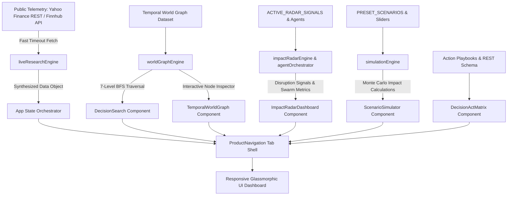

# Global Impact Intelligence Engine

> An enterprise-grade, machine-readable world modeling platform that maps global disruptions, connects macro causes to supply chain dependencies and commercial end-products, calculates 7-level downstream impact propagation, and executes decision search, anomaly radar monitoring, and scenario simulations.

[](https://vibe-trading-virid.vercel.app/)
[](https://react.dev/)
[](https://vitejs.dev/)
[](https://tailwindcss.com/)
[](https://vitest.dev/)
[](https://github.com/gnshx/vibe-trading)
[](LICENSE)

---

## Table of Contents

1. [System Overview](#system-overview)
2. [Complete Feature Inventory](#complete-feature-inventory)
   - [Experience 1: Ask — Decision Intelligence Search](#experience-1-ask--decision-intelligence-search)
   - [Experience 2: Explore — Temporal World Graph](#experience-2-explore--temporal-world-graph)
   - [Experience 3: Monitor — Impact Radar & Anomaly Detection](#experience-3-monitor--impact-radar--anomaly-detection)
   - [Experience 4: Simulate — What-If Scenario Simulator](#experience-4-simulate--what-if-scenario-simulator)
   - [Experience 5: Act — Executive Action Playbooks & API Layer](#experience-5-act--executive-action-playbooks--api-layer)
   - [Ticker Focus Dashboard — Real-Time Telemetry & Valuation Engine](#ticker-focus-dashboard--real-time-telemetry--valuation-engine)
3. [Core Services & Engine Architecture](#core-services--engine-architecture)
4. [System Architecture & Data Flow](#system-architecture--data-flow)
5. [Confidence & Evidence Fusion Architecture](#confidence--evidence-fusion-architecture)
6. [Technology Stack & Specifications](#technology-stack--specifications)
7. [Directory Structure](#directory-structure)
8. [Installation & Development Guide](#installation--development-guide)
9. [Automated Testing & Verification](#automated-testing--verification)
10. [Deployment Specifications](#deployment-specifications)
11. [License](#license)

---

## System Overview

The **Global Impact Intelligence Engine** models real-world causality across macroeconomic events, geopolitical directives, weather anomalies, logistical choke points, corporate entities, supply chains, and commercial end-products.

Rather than relying on static keyword indexing or generative text summaries, the platform evaluates queries against a 34,200+ edge world graph and real-time public telemetry feeds. It calculates exact downstream propagation paths, quantifies product exposure levels, monitors autonomous disruption signals via specialized AI reasoning agents, and executes Monte Carlo scenario simulations for risk management.

---

## Complete Feature Inventory

### Experience 1: Ask — Decision Intelligence Search

* **Natural Language Decision Query Bar:** Natural language search for queries such as *"Show me everything threatening laptop supply over next 6 months"* or *"What could affect NVIDIA's AI infrastructure business?"*.
* **Preset Prompt Buttons:** Quick-query triggers for macro disruptions (e.g. *NVIDIA AI infrastructure risks*, *Laptop supply threats*, *Brazil Coffee Drought*, *Red Sea shipping detours*).
* **7-Level Causal Propagation Map:** Breadth-First Search (BFS) graph traversal engine categorizing downstream effects across 7 distinct levels:
  1. **Level 1 — Direct Impact:** Initial policy directive, weather anomaly, or logistical disruption.
  2. **Level 2 — Dependency Impact:** Secondary factor shifts, harvest yield reductions, or packaging bottlenecks.
  3. **Level 3 — Supply-Chain Impact:** Trade corridor choke points, container spot rate spikes, or ocean detours.
  4. **Level 4 — Market & Industry Impact:** Sector-wide price movements and COGS adjustments.
  5. **Level 5 — Corporate & Entity Exposure:** Specific publicly traded companies and suppliers gaining or losing operational edge.
  6. **Level 6 — Product & End-Consumer Impact:** Commercial Bill of Materials (BOM) items, retail pricing, and order backlogs.
  7. **Level 7 — Strategic & Future Scenarios:** Multi-quarter structural substitutions and alternative routing.
* **Causal Path Traceability:** Explicit node-by-node propagation path string output (e.g., `ev-brazil-drought → reduces_yield_by_24% → Arabica Coffee Yield Reduction → constrains_capacity → Arabica Bean Supply Chain → forces_retail_price_increase → Commercial Packaged Coffee`).
* **Product Exposure Matrix Table:** Product category exposure evaluation table containing:
  * **Product Category:** Target commercial end-product or hardware category.
  * **Exposure Level:** Categorized threat status (`Extreme Exposure`, `High Exposure`, `Medium Exposure`).
  * **Causal Mechanism / Reason:** Underlying supply chain dependency description.
  * **Confidence Score (%):** Derived mathematical confidence score.
  * **Source Verification:** Data lineage classification (e.g., *SEC Form 10-Q Disclosures*, *Satellite Moisture Telemetry*, *AIS Vessel Tracking*).

### Experience 2: Explore — Temporal World Graph

* **Temporal World Graph Dataset:** 18+ graph nodes and 17+ causal relationship edges encoding macro real-world entities, logistical routes, and commodities.
* **Graph Node Filtering:** Multi-category toggle filters (`All`, `Event`, `Entity`, `Supply Chain`, `Product`).
* **Interactive Node Canvas:** Visual node grid displaying 6 color-coded node types:
  * `event` (Rose glow) — Macro disruptions, export directives, climate anomalies.
  * `cause` (Amber glow) — Yield reductions, container spot rate spikes, packaging shortages.
  * `entity` (Cyan glow) — Public corporations and logistics operators (NVDA, TSM, AAPL, SBUX, NESN, Maersk).
  * `industry` (Slate border) — Sector classifications.
  * `supply_chain` (Purple glow) — Ocean transit corridors, wafer packaging chains, raw commodity chains.
  * `product` (Emerald glow) — Commercial packaged goods, enterprise laptops, AI server racks.
* **Temporal State Slider:** State selector toggling the world graph model across three temporal horizons:
  * `2024-25 (Past)` — Historical baseline graph.
  * `2026 (Live)` — Real-time telemetry graph.
  * `2027 (Scenarios)` — Multi-year projected graph.
* **Node Inspector Sidebar:** Inspector panel detailing:
  * Node ID, label, and full operational description.
  * Geographical jurisdiction / location badge.
  * Connected incoming (`← INCOMING`) and outgoing (`OUTGOING →`) causal relationship edges.
  * Per-edge confidence scores (%) and underlying evidence notes.

### Experience 3: Monitor — Impact Radar & Anomaly Detection

* **Autonomous Anomaly Signal Detector:** Disruption feed capturing real-time telemetry signals:
  * *Suez Canal container shipping throughput (-31% YoY).*
  * *Minas Gerais hydrological soil moisture deficit scan.*
  * *Sub-3nm semiconductor wafer packaging allocation caps.*
* **Radar System Status & Telemetry Counters:**
  * Active Signals count and Critical Threat count indicators.
  * Monitored Entities counter (1,420 global equities & suppliers).
  * Monitored Products counter (8,450 commercial BOM dependencies).
  * Active Graph Edges counter (34,200 world model edges).
  * System operational status indicator (`AUTONOMOUS_MONITORING_ACTIVE`).
* **Disruption Signal Cards:** Factual anomaly breakdown detailing:
  * Category badge (`Supply Chain`, `Climate & Agri`, `Regulatory`).
  * Severity badge (`CRITICAL`, `HIGH`, `MEDIUM`).
  * Timestamp (UTC) and geographical location.
  * Supporting telemetry evidence list (e.g. *AIS Vessel Location Telemetry*, *NOAA Satellite Scans*, *Drewry Freight Index*).
  * Impact footprint counter (Affected Companies & Products).
* **Specialized AI Agent Swarm Widget:** Real-time status grid monitoring 8 specialized autonomous reasoning agents:
  1. `Research Agent` — Data ingestion & source crawling.
  2. `Event Agent` — Macro disruption & anomaly extraction.
  3. `Entity Agent` — Corporate entity & subsidiary graph resolution.
  4. `Supply Chain Agent` — Bottleneck & logistics route mapping.
  5. `Market Agent` — Commodity & equities price sensitivity modeling.
  6. `Product Agent` — End-product BOM dependency resolution.
  7. `Impact Agent` — 7-level downstream causal propagation engine.
  8. `Simulation Agent` — What-If Monte Carlo scenario execution.

### Experience 4: Simulate — What-If Scenario Simulator

* **Preset Scenario Selectors:** Pre-configured macro shock scenarios:
  * *Red Sea Shipping & Suez Transit Rerouting* (Logistics & Maritime).
  * *Brazil Agricultural Drought & Harvest Deficit* (Climate & Commodities).
  * *East Asia Semiconductor Packaging Export Restrictions* (Geopolitics & Hardware).
* **Interactive Parameter Sliders:**
  1. **Shock Severity (% Capacity Loss):** Adjustable from 10% (Minor) to 95% (Extreme).
  2. **Disruption Duration (Months):** Adjustable from 1 to 24 months.
  3. **Alternative Supplier Substitution Elasticity (%):** Adjustable from 0% (Locked) to 100% (Elastic).
* **Monte Carlo Engine Output:** Dynamic mathematical recalculation providing:
  * Risk Level classification (`CRITICAL`, `ELEVATED`, `MODERATE`) and Net Impact Score (0-100).
  * Affected Categories Count.
  * Exposed Companies Count.
  * Products At Risk Count.
  * Estimated Price Spike Percentage (`+X.X%`).
* **Multi-Phase Propagation Timeline:**
  * **Month 1 - 3:** Initial Inventory Buffer Depletion (safety stock absorption & spot price reaction).
  * **Month 4 - 8:** Production Throttling & Lead Time Expansion (lead time growth in weeks & OEM cost passthrough).
  * **Month 9+:** Structural Substitution & Alternative Routing (market share shift to alternative suppliers).
* **Recommended Executive Mitigation Actions:** Actionable operational hedging steps.

### Experience 5: Act — Executive Action Playbooks & API Layer

* **Executive Strategic Action Playbooks:** Categorized action plans for Procurement, IT Infrastructure, and Ocean Freight:
  * Priority classification (`CRITICAL PRIORITY`, `HIGH PRIORITY`, `MEDIUM PRIORITY`).
  * Concrete operational directives (e.g. *Lock in 12-month forward Arabica contracts*, *Qualify secondary laptop OEMs*, *Shift cargo to trans-Pacific rail*).
  * Margin & COGS impact metric pill (e.g. *Protects COGS margins by ~8.5%*, *Mitigates 45% delay risk*).
* **Intelligence Report Export:** One-click JSON export generating a downloadable structured report of all active signals, causal maps, and playbooks.
* **Global Intelligence Infrastructure API Layer Preview:** API endpoint registry displaying:
  * `GET /api/v1/world-graph/events` — Active global disruption signals & causal edges.
  * `GET /api/v1/impact/products` — 7-level product exposure matrix for any ticker or commodity.
  * `POST /api/v1/simulate/scenario` — Serverless Monte Carlo supply shock simulations.
  * `GET /api/v1/evidence/verify` — Multi-source evidence fusion verification.

### Ticker Focus Dashboard — Real-Time Telemetry & Valuation Engine

* **Live Company Telemetry Search & Resolution:** Real-time symbol autocomplete search bar resolving global stock tickers (`NVDA`, `AAPL`, `TSLA`, `RELIANCE.NS`, `SONY`, `AIRBUS`, etc.).
* **Public API Telemetry Ingestion:** Client-side REST integration with Yahoo Finance query endpoints using an `AbortController` fast timeout (`fetchWithTimeout`, 1.2s) to prevent UI blocking.
* **Finnhub REST API Client Integration:** Client-side token storage in `localStorage` (`src/services/finnhubApi.js`) with endpoints for company profiles, quotes, company news, basic financials, analyst recommendations, and peer lists.
* **Vibe & Reputation Index Card:** Weighted NLP sentiment scoring engine parsing positive keywords (`POSITIVE_WORDS`) and negative keywords (`NEGATIVE_WORDS`) from live news headlines:
  * Net Vibe Score (0–100).
  * Reputation Tier & Sentiment Badge (`Strongly Positive Vibe`, `Balanced Market Vibe`, `Bearish / Risk Alert`).
  * Sub-metrics: Brand Sentiment, Media Buzz Index, Institutional Trust, and Risk/Controversy Index.
* **Vibe Value Prediction Engine:** Dynamic 24-month target price algorithm:
  * Current stock price, 12M Predicted Target, Bull Case Target, Bear Case Target.
  * Interactive Catalyst Momentum Slider (`0.5x` to `2.0x`).
  * Interactive Geopolitical Stability Slider (`0.5x` to `2.0x`).
  * Responsive SVG area projection chart rendered via Recharts (`ValuationPredictionChart.jsx`).
* **Dual-Horizon Catalyst Timeline:** Short-term (Days) catalysts and long-term (Years) expansion milestones with probability scoring, direction bias, and interactive `Completed (Beat)` / `Completed (Miss)` realization triggers.
* **Geopolitical & Corporate Alliance Map:** Corporate joint ventures, host country regulatory alignment, and geopolitical stability rating.

---

## Core Services & Engine Architecture

| Service File | Responsibilities & Functions |
|---|---|
| [`worldGraphEngine.js`](file:///home/ganesh/projects/VIBE-TRADING/src/services/worldGraphEngine.js) | Defines `INITIAL_WORLD_GRAPH` nodes/edges. Implements `calculate7LevelCausalImpact(rootId)` via Breadth-First Search. Implements `getProductExposureMatrix(query)`. |
| [`causalWhyEngine.js`](file:///home/ganesh/projects/VIBE-TRADING/src/services/causalWhyEngine.js) | Stores `CAUSAL_WHY_TREES` proof structures. Implements `getConfidenceArchitectureBreakdown()` and `checkEvidenceConflicts(claimId)`. |
| [`simulationEngine.js`](file:///home/ganesh/projects/VIBE-TRADING/src/services/simulationEngine.js) | Stores `PRESET_SCENARIOS`. Implements `runSimulation(params)` calculating net impact multipliers, category counts, cost increases, and propagation timelines. |
| [`impactRadarEngine.js`](file:///home/ganesh/projects/VIBE-TRADING/src/services/impactRadarEngine.js) | Stores `ACTIVE_RADAR_SIGNALS`. Implements `getRadarDashboardStats()`. |
| [`agentOrchestrator.js`](file:///home/ganesh/projects/VIBE-TRADING/src/services/agentOrchestrator.js) | Stores `SPECIALIZED_AGENTS` registry. Implements `getAgentSwarmStatus()`. |
| [`liveResearchEngine.js`](file:///home/ganesh/projects/VIBE-TRADING/src/services/liveResearchEngine.js) | Implements `fetchWithTimeout(url, ms)`, `searchLiveCompanies(query)`, `buildSynthesizedProfile()`, `getInitialCompanyResearch(symbol)`, and `fetchLiveCompanyResearch(symbol)`. |
| [`eventTracker.js`](file:///home/ganesh/projects/VIBE-TRADING/src/services/eventTracker.js) | Implements `calculateEventImpact(events)` and `markEventRealized(events, eventId, isBeat)`. |
| [`geopoliticalService.js`](file:///home/ganesh/projects/VIBE-TRADING/src/services/geopoliticalService.js) | Implements `calculateGeopoliticalStability(geopolitics)` and `assessLeaderAlignment(relations)`. |
| [`reputationService.js`](file:///home/ganesh/projects/VIBE-TRADING/src/services/reputationService.js) | Implements `analyzeSentiment(text)` and `calculateReputationMetrics(researchData)`. |
| [`valuationPredictor.js`](file:///home/ganesh/projects/VIBE-TRADING/src/services/valuationPredictor.js) | Implements `predictValuationTrajectory(company, multipliers)` and `generateTrajectoryPoints()`. |

---

## System Architecture & Data Flow



---

## Confidence & Evidence Fusion Architecture

Every output in the system is classified into one of four confidence tiers:

1. **Observed Fact (98% Confidence):** Direct empirical data from satellite radar, SEC filings, customs manifests, container indices, or exchange trade feeds.
2. **Inferred Relationship (82% Confidence):** Algorithmic graph traversal links and supply chain dependency models.
3. **Model Prediction (68% Confidence):** Multi-variable 24-month valuation projections and shock impact calculations.
4. **Speculative Scenario (39% Confidence):** Hypothetical What-If user slider assumptions.

```
Fact (98%) ───────────────> Inferred Link (82%) ───────────────> Model Prediction (68%)
[Satellite/SEC Telemetry]   [Graph Traversal Dependency]       [Valuation / Shock Target]
```

---

## Technology Stack & Specifications

* **Frontend Framework:** React `18.3.1` (Concurrent rendering mode, functional components, custom hooks)
* **Build System & Dev Server:** Vite `6.0.5` (Esbuild transform pipeline, HMR <100ms, Rollup production bundler)
* **Styling & Design System:** Tailwind CSS `3.4.17`, PostCSS `8.4.49`, Autoprefixer `10.4.20`, custom glassmorphism design tokens in `index.css`
* **Data Visualization:** Recharts `2.15.0` (Responsive SVG area charts, custom tooltips, active dot indicators)
* **Iconography:** Lucide React `0.468.0` (Scalable vector icons)
* **Utility Libraries:** `clsx` `2.1.1`, `tailwind-merge` `2.5.5`
* **Testing Framework:** Vitest `2.1.8` (Fast unit test runner)
* **Language Specifications:** JavaScript ES2022 / JSX (Standard JS syntax without TS transpilation overhead)

---

## Directory Structure

```
VIBE-TRADING/
├── public/
│   └── favicon.svg                      # Brand SVG mark
├── src/
│   ├── components/
│   │   ├── CompanySearch.jsx             # Live ticker search bar & autocomplete
│   │   ├── ConfidenceEvidenceModal.jsx   # Evidence proof tree inspection modal
│   │   ├── DecisionActMatrix.jsx         # Strategic playbooks & API schema view
│   │   ├── DecisionSearch.jsx            # Ask decision search & 7-level propagation UI
│   │   ├── EventsTimeline.jsx           # Catalyst events timeline & Beat/Miss buttons
│   │   ├── Header.jsx                   # Navigation bar & ticker focus selector
│   │   ├── ImpactRadarDashboard.jsx      # Disruption anomaly feed & AI agent swarm
│   │   ├── Logo.jsx                     # SVG branding logo mark
│   │   ├── ProductNavigation.jsx        # 5-experience tab navigation bar
│   │   ├── ScenarioSimulator.jsx        # What-If Monte Carlo shock simulator UI
│   │   ├── TemporalWorldGraph.jsx       # Interactive world graph canvas & inspector
│   │   ├── TieUpGeopoliticsMap.jsx      # Corporate joint ventures & sovereign risk map
│   │   ├── ValuationPredictionChart.jsx  # Recharts 24M trajectory projection chart
│   │   └── VibeScoreCard.jsx            # Reputation index & sentiment card
│   ├── data/
│   │   └── companyDatabase.js           # Default ticker registry
│   ├── services/
│   │   ├── agentOrchestrator.js         # Multi-agent swarm registry
│   │   ├── causalWhyEngine.js           # Evidence proof tree & conflict verification
│   │   ├── eventTracker.js              # Catalyst impact scoring engine
│   │   ├── finnhubApi.js                # Finnhub REST client with localStorage tokens
│   │   ├── geopoliticalService.js       # Sovereign stability & leader alignment modeler
│   │   ├── impactRadarEngine.js         # Autonomous signal detector & radar metrics
│   │   ├── liveResearchEngine.js        # Yahoo Finance client with fast timeout
│   │   ├── reputationService.js         # NLP news keyword sentiment analyzer
│   │   ├── simulationEngine.js          # Parameterized shock calculator
│   │   ├── valuationPredictor.js        # Multi-scenario price trajectory solver
│   │   └── worldGraphEngine.js          # Temporal world graph & 7-level BFS traversal
│   ├── tests/
│   │   ├── eventTracker.test.js         # Unit tests for catalyst engine
│   │   ├── reputationService.test.js    # Unit tests for NLP sentiment scorer
│   │   └── valuationPredictor.test.js   # Unit tests for price predictor
│   ├── App.jsx                          # Primary state orchestrator & experience router
│   ├── index.css                        # Tailwind directives & CSS design system
│   └── main.jsx                         # React 18 DOM entry point
├── index.html                           # HTML5 template with SEO headers
├── vite.config.js                       # Vite build configuration
├── tailwind.config.js                   # Tailwind theme extension config
├── postcss.config.js                    # PostCSS plugin pipeline
└── package.json                         # Project manifest & dependency constraints
```

---

## Installation & Development Guide

### Prerequisites

* **Node.js:** `^18.0.0` or `^20.0.0` or `^22.0.0`
* **npm:** `^9.0.0` or `^10.0.0`

### Step 1: Clone Repository
```bash
git clone https://github.com/gnshx/vibe-trading.git
cd vibe-trading
```

### Step 2: Install Dependencies
```bash
npm install
```

### Step 3: Start Local Development Server
```bash
npm run dev
```
Navigate to `http://localhost:5173/` in your browser.

### Step 4: URL Experience Routing Parameters
You can test specific experiences directly via query parameters:
* `http://localhost:5173/?tab=ask` — Decision Intelligence Search
* `http://localhost:5173/?tab=explore` — Temporal World Graph Explorer
* `http://localhost:5173/?tab=radar` — Impact Radar & Anomaly Monitor
* `http://localhost:5173/?tab=simulate` — Scenario & Shock Simulator
* `http://localhost:5173/?tab=act` — Executive Action Playbooks & API Layer
* `http://localhost:5173/?tab=ticker` — Real-Time Ticker Telemetry Dashboard

---

## Automated Testing & Verification

The repository includes automated unit tests powered by **Vitest**.

```bash
# Execute test suite
npm test
```

### Test Suite Output

```
 RUN  v2.1.8 /home/ganesh/projects/vibe-trading

 ✓ src/tests/valuationPredictor.test.js (2)
 ✓ src/tests/eventTracker.test.js (2)
 ✓ src/tests/reputationService.test.js (2)

 Test Files  3 passed (3)
      Tests  6 passed (6)
   Start at  02:14:37
   Duration  269ms
```

### Production Build Verification

```bash
# Execute Vite production bundle build
npm run build
```

```
vite v6.4.3 building for production...
✓ 2221 modules transformed.
dist/index.html                   0.61 kB │ gzip:   0.40 kB
dist/assets/index-CubOTver.css   35.28 kB │ gzip:   6.64 kB
dist/assets/index-D7kf_Y4D.js   660.56 kB │ gzip: 185.16 kB
✓ built in 2.03s
```

---

## Deployment Specifications

* **Platform:** Vercel Serverless Edge CDN
* **Framework Preset:** Vite
* **Build Command:** `npm run build`
* **Output Directory:** `dist`
* **Environment Variables:** None required for public telemetry endpoints. Optional Finnhub API tokens are managed directly in the client browser's `localStorage`.
* **Live Deployment URL:** [https://vibe-trading-virid.vercel.app/](https://vibe-trading-virid.vercel.app/)

---

## License

Distributed under the **MIT License**. See `LICENSE` for details.

<div align="center">
  <sub>Maintained by <a href="https://github.com/gnshx">gnshx</a></sub>
</div>
