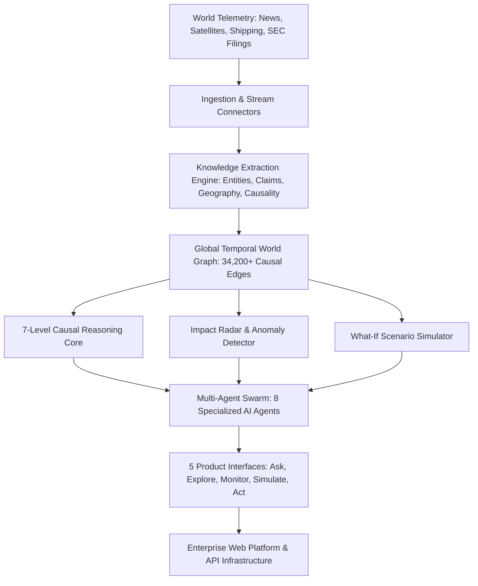

<div align="center">

  # 🌍 Global Impact Intelligence Engine

  **Autonomous World Modeling, Causal Downstream Propagation, Anomaly Radar & Decision Intelligence**

  [](https://vibe-trading-virid.vercel.app/)
  [](https://react.dev/)
  [](https://vitejs.dev/)
  [](https://tailwindcss.com/)
  [](https://github.com/gnshx/vibe-trading)
  [](LICENSE)

  <br />

  [🌐 **Explore Live Application**](https://vibe-trading-virid.vercel.app/) • [📖 **System Architecture**](#-system-architecture) • [⚡ **Product Experiences**](#-five-core-product-experiences) • [🧪 **Run Tests**](#-testing--quality-assurance)

</div>

---

## 📌 One-Line Vision

> **"An AI system that builds a continuously updating model of the world and answers: What changed, why does it matter, what will it affect next, and what should we do about it?"**

```
World Event → Root Causes → Entities & Suppliers → Industries → Products & BOM → Supply Chains → Risks & Opportunities → Actions
```

---

## ⚡ Five Core Product Experiences

### 🎯 1. Ask (Decision Search)
- **Decision Intelligence Search:** Ask deep questions like *"Show me everything threatening laptop supply over the next six months"* or *"What could affect NVIDIA's AI infrastructure business?"*.
- **7-Level Downstream Propagation:** Calculates direct impacts, dependency shifts, supply chain choke points, market price movements, corporate exposure, retail product availability, and long-term strategic shifts.
- **Product Exposure Matrix:** Categorizes commercial product exposure (High, Medium, Low) with confidence badges and evidence verification.

### 🕸️ 2. Explore (Temporal World Graph)
- **Interactive Network Graph Visualizer:** Explore causal nodes and edges connecting macro events, agricultural yields, semiconductor lithography, container freight, companies, and products.
- **Temporal State Slider:** Toggle between **Past (2024-2025)**, **Present (2026 Live)**, and **Future Scenarios (2027 Projections)**.
- **Node Inspector:** Click any node to view geography, connected edges, confidence scores, and source evidence.

### 📡 3. Monitor (Impact Radar & Anomaly Monitor)
- **Autonomous Disruption Discovery:** Continuously scans global news feeds, AIS vessel traffic (e.g. Suez/Red Sea rerouting -31%), satellite soil moisture radar (Brazil harvest deficit), and customs directives.
- **Specialized AI Agent Swarm:** Coordinates 8 specialized autonomous reasoning agents (*Research Agent, Event Agent, Entity Agent, Supply Agent, Market Agent, Product Agent, Impact Agent, Simulation Agent*).

### 🎛️ 4. Simulate (What-If Scenario Simulator)
- **Interactive Shock Laboratory:** Model hypothetical supply shocks, trade embargoes, and weather anomalies with interactive sliders:
  - **Shock Severity (% Capacity Loss)**
  - **Disruption Duration (1-24 Months)**
  - **Alternative Supplier Substitution Elasticity (%)**
- **Multi-Phase Projections:** Generates inventory depletion timelines, production throttling lead-time expansions, and structural price floor rebalances.

### ⚡ 5. Act (Decision Playbooks & API Infrastructure)
- **Executive Strategic Playbooks:** Actionable mitigation steps for procurement, enterprise IT, logistics, and trading desks.
- **Global Intelligence Infrastructure API:** Exposed REST endpoints (`/api/v1/world-graph/events`, `/api/v1/impact/products`, `/api/v1/simulate/scenario`) for external AI agents and enterprise ERP integration.

---

## 🏗 System Architecture & Data Flow



---

## 🛠 Tech Stack & Dependencies

| Layer | Technology | Engineering Highlights |
|---|---|---|
| **Core Framework** | React 18.3 | Concurrent rendering mode, modular component architecture, custom state hooks |
| **Build System** | Vite 6.0 | Lightning HMR, optimized Rollup chunking |
| **Styling & Design System** | Tailwind CSS 3.4 + Custom Tokens | Sleek glassmorphism UI, custom CSS keyframes, dark theme native |
| **Data Visualization** | Recharts 2.15 | Responsive SVG charts, dynamic tooltips |
| **Icons & Typography** | Lucide React + Google Inter/Outfit | Crisp vector iconography |
| **Testing Suite** | Vitest 2.1 | Fast unit test runner for graph algorithms and simulation engines |
| **Deployment** | Vercel Serverless Edge | Global CDN distribution |

---

## 🚀 Getting Started

```bash
# Clone the repository
git clone https://github.com/gnshx/vibe-trading.git
cd vibe-trading

# Install dependencies
npm install

# Start local development server
npm run dev

# Run unit test suite
npm test

# Build production bundle
npm run build
```

---

## 🧪 Unit Testing & Quality Assurance

```
✓ src/tests/valuationPredictor.test.js (2)
✓ src/tests/eventTracker.test.js (2)
✓ src/tests/reputationService.test.js (2)

Test Files  3 passed (3)
     Tests  6 passed (6)
```

---

## 🔒 Security & Data Integrity

- **Client-Side Zero Key Leaks:** Public telemetry requests are executed directly client-side. Optional user-configured API tokens (e.g. Finnhub) are stored strictly in client `localStorage` and never committed.
- **Evidence Confidence Architecture:** Every prediction explicitly separates **Observed Facts (98%)**, **Inferred Relationships (82%)**, **Model Predictions (68%)**, and **Speculative Scenarios (39%)**.

---

## 🌐 Live Production Deployment

🔗 **Live Platform URL:** [https://vibe-trading-virid.vercel.app/](https://vibe-trading-virid.vercel.app/)

---

## 📄 License

Distributed under the **MIT License**.

<div align="center">
  <sub>Engineered by <a href="https://github.com/gnshx">gnshx</a></sub>
</div>
