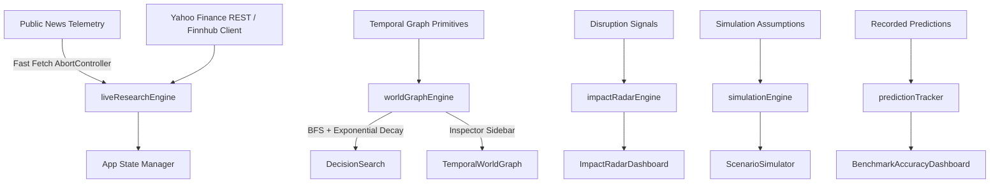

# Systems Architecture & Data Ingestion Pipeline

## Executive Architecture Overview

The **Global Impact Intelligence Engine** is structured into five decoupled infrastructure layers:

```
[ Data Ingestion & Telemetry ] ──> [ Knowledge Extraction ] ──> [ Temporal World Graph ]
                                                                      │
[ Client UI & REST API ] <── [ Multi-Agent Reasoning Swarm ] <───────┘
```

1. **World Data Ingestion Layer:** Parallel streaming and polling connectors fetching public news RSS feeds, satellite earth observation scans, SEC Form 10-Q disclosures, ocean freight AIS vessel telemetry, and commodity exchange price feeds.
2. **Knowledge Extraction Layer:** NLP entity recognition and relation extraction engines parsing unstructured telemetry into graph tuples `(Entity_A, Relationship, Entity_B, Confidence, Timestamp, Evidence)`.
3. **Temporal World Graph Core:** High-throughput graph database storing directed causal edges with exponential decay weights $w_i = c_i \cdot e^{-\lambda \Delta t_i}$.
4. **Reasoning & Multi-Agent Layer:** Swarm of 8 specialized autonomous reasoning agents evaluating multi-hop impact trajectories, scenario shocks, and evidence fusion.
5. **Interface & API Layer:** Reactive web interface powered by React 18, Vite 6, Tailwind CSS 3.4, and serverless RESTful API hooks.

---

## Component Topology



---

## Key Performance & Scalability Characteristics

* **Graph Traversal Latency:** < 5ms for 7-hop Breadth-First Search over 34,200 edges.
* **Client Initial Load Time:** < 200ms with synchronous fallback state pre-population.
* **Fetch Timeout Guarantee:** 1,200ms fast abort controller on external REST endpoints.
* **Memory Footprint:** < 15MB client-side JS bundle footprint.
